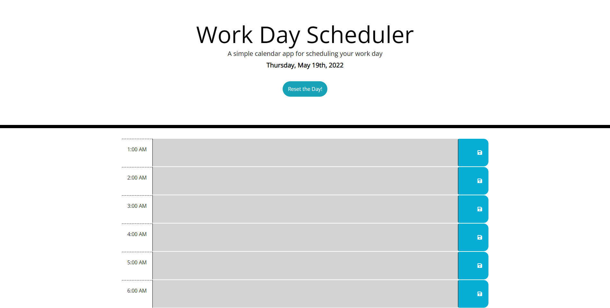
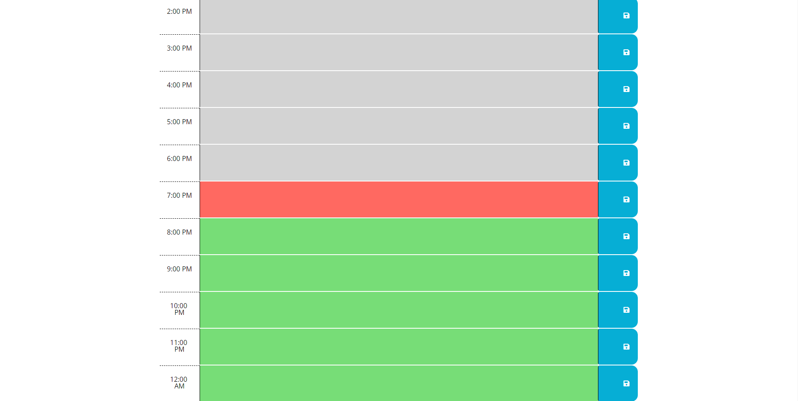
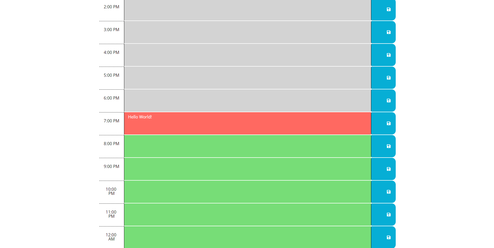

# Work Day Scheduler

## Description

The purpose of this application is to keep track of the user's daily schedule.
When the user has something to do later in the day or even the night, they will be able to add their tasks onto the application and press save. The scheduler will save the user's input until the user resets the day by pressing the button.

If you would like to see the application, please [click here](https://lunirs.github.io/work-day-scheduler/) to be redirected to my deployed link.

## Installation

In order to obtain the final application, Bootstrap, jQuery, google fonts, and moment were utilized.

Most of the spacings were done by using bootstrap style methods on the HTML side.

First, a div was created to contain the area the current hour displays, the text area where the user can input their tasks, and the button they can press to save their tasks onto the local storage. Within the container div, a div, textarea, and button was created to be inline with each other by assigning number where all 3 adds up to 12. Since the text area was the biggest out of all, I assigned it as 10 and the time display div and button to 1 each. This splits up the areas nicely.

The save button's icon was taken from fontawesome.

Once one was created, I copied and pasted to create 24 rows of time blocks.

I then added event listeners to the buttons to store the text area data onto the local storage and then called upon the data. This way, even if the page is reloaded, the data would not be wiped.

Momentjs was used to display the current date to the header and to allow me to add certain classes to each container's text area via a for loop.

The text area representing the present time would display red. The text area representing future times would be displayed green. The text area representing the past times would be displayed gray.

## Usage

### Please see the following screenshots to see what the page would look like when you click on my deployed link in the [description section](#description)!

## Credits

The following application was created through the use of the following references.

[Bootstrap](https://getbootstrap.com/)
[Momentjs](https://momentjs.com/)
[Fontawesome](https://fontawesome.com/)

## License

Copyright (c) [2022] [Daniel Hong]
